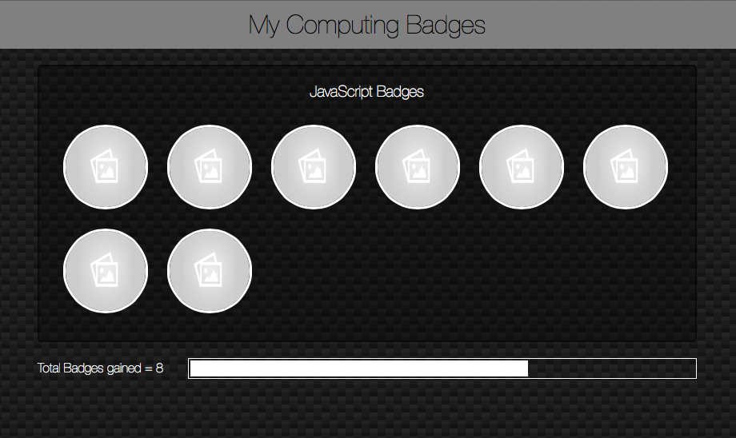

## Year 7 - Web Development - An Introduction to JavaScript

###Target year group or age

Year 7

###Purpose of Module

The purpose of this module is to introduce students to their first text-based programming language, and a few key concepts in Computer Science
The module builds upon the student's experience writing HTML and CSS, by using JavaScipt in a familair environment.

###Knowledge and Skills

* I/O with JavaScript
* Variable decleration, assignment and reassignment
* Conditional statements
* Iteration
* Functions

###Cross-Curricula links

###Progression from this module

Web Development - Building games with JavaScript

###Example work

The conlcusion of the project, is to produce a Web Page for displaying digital badges that have been earned by the student.

###Glossary

|          |        |         |           |
|----------|--------|---------|-----------|
|Script tag|Variable|Declare  |Assign     |
|Strings   |Boolean |Console  |Conditional|
|Operator  |Loop    |For      |Iteration  |
|Function  |DOM     |         |           |

###Self-assessment questions

_How many badges did I obtain?_
_What was the easiest thing to do in JavaScript?_
_What was the hardest thing to do in JavaScript?_
_What was the thing I enjoyed the most about this topic?_
_If I had to do this topic again, what would I do differently?_

###Work-criteria check-list

|1|2|
|Asks for name|
|Uses name in reply|
|Asks for age|
|Uses in calculation|

###Homework

This module is self-paced. Students should continue to work on the problems both inside and outside of lessons.
Depending on lesson length, student ability and time spent outside of lessons, I have found that each activity takes the students between 1 and 2 hours to complete.

###[DfE Computing Curriculum mapping]((https://www.gov.uk/government/publications/national-curriculum-in-england-computing-programmes-of-study)
* design, use and evaluate computational abstractions that model the state and behaviour of real-world problems and physical systems
* use two or more programming languages, at least one of which is textual, to solve a variety of computational problems; make appropriate use of data structures [for example, lists, tables or arrays]; design and develop modular programs that use procedures or functions

###[CaS Progression Pathways mapping](http://community.computingatschool.org.uk/resources/1692)
* Understands the difference between, and appropriately uses if and if, then and else statements. Uses a variable and relational operators within a loop to govern termination. Designs, writes and debugs modular programs using procedures. Knows that a procedure can be used to hide the detail with sub-solution (procedural abstraction).

###Lessons - Student resources

[Lesson 1 - An Introduction to Javascript]()
[Lesson 2 - Conditionals and the Console]()
[Lesson 3 - The Value of Variables]()
[Lesson 4 - Dominating the DOM]()
[Lesson 5 - Loopy JavaScript]()
[Lesson 6 - A Functional Project]()

### Lessons - Teacher resources

[Lesson 1 - An Introduction to Javascript]()
[Lesson 2 - Conditionals and the Console]()
[Lesson 3 - The Value of Variables]()
[Lesson 4 - Dominating the DOM]()
[Lesson 5 - Loopy JavaScript]()
[Lesson 6 - A Functional Project]()

###Resources

Computers with a web-browser and a text-editor installed are all that are needed.

Recommended web-browsers are as follows:
:poop: [I.E.](http://www.mozilla.org/en-GB/firefox/new/)  
:snail: [Safari](http://www.mozilla.org/en-GB/firefox/new/)  
:see_no_evil: [Chrome]((http://www.mozilla.org/en-GB/firefox/new/)  
:smiling_imp: [FireFox](http://www.mozilla.org/en-GB/firefox/new/)  

Recommended text-editors are as follows
:bowtie: [Sublime Text](http://www.sublimetext.com)  
:sunglasses: [Atom](https://atom.io)  
:neckbeard: [Emacs](http://www.gnu.org/software/emacs/)  

